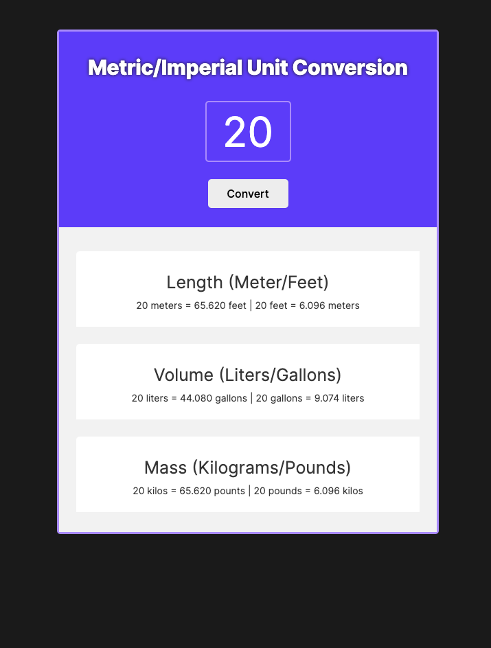

# Unit Converter

#### This project includes HTML/CSS and JavaScript in order to convert a number from Metric to Imperial units, and also Imperial to Metric Units.  Implemented design and functionality from the ground up.  Uses manipulation of the DOM and calculations of math and rounding to 3 decimal places.

https://jacksondynamics.github.io/UnitConverter/

